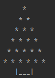

 
 

 # Ściągawka z logiki  

 |**p**|**q**|**p--->g**[^1]|**p<--->g**[^2]|**p v g**[^3]|[^4] **p ʌ q**        
 |:---:|:---:|:---:| :---:|:---:|:---:  
 |0|1|1 | 0|1|0
 |1|0|0 | 0|1|0
 |0|0|1 | 1|0|0
 |1|1|1 | 1|1|1    

filmy warte obejrzenia dotyczące logiki:  
1. [etrapez](https://www.youtube.com/watch?v=ydOE7QQQ5q0) - etrapez  
2. [master of mathematics](https://www.youtube.com/watch?v=IlNvtveESII) - master of mathematics 


 
 # choinka w pythonie 
 dowolnytekst
 
  
 ```py   

print("Choinka  o rozmiarze n :\n")
n = 6
for i in range (1, n + 1):
    print( ( ( n - i)  ) * " ", end="")
    print( i * "* ")

if n % 2 == 0 :
   print ( ( (n // 2) * 2 - 3) * " ", end="|___|\n")

else:
   print(((n // 2) * 2 - 2) * " ", end="|___|\n") 
   
``` 


 # przypisy
 

 [^1]: Z p wynika q  

 [^2]: Z p jest wtedy i tylko wtedy gdy q  

 [^3]: p lub q  

 [^4]: p i q


